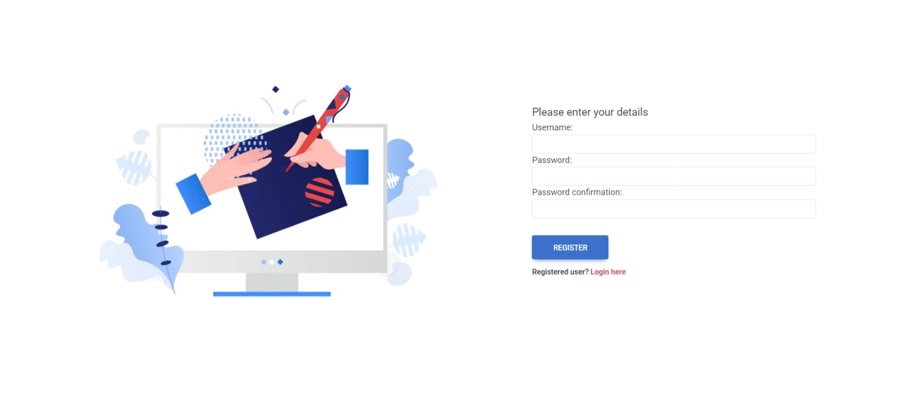
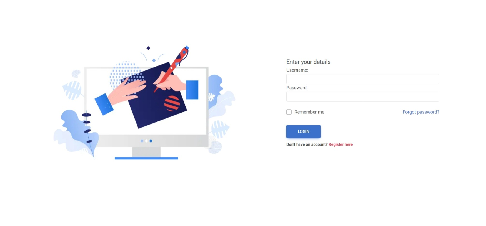
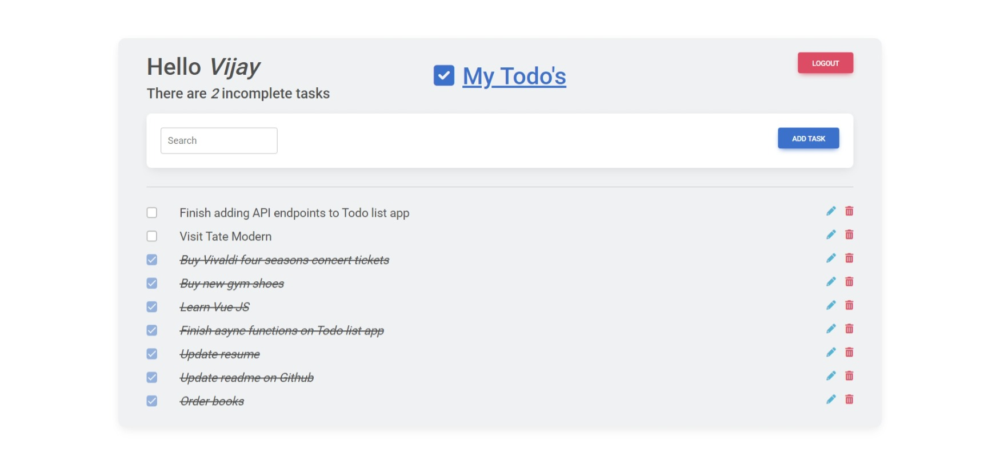
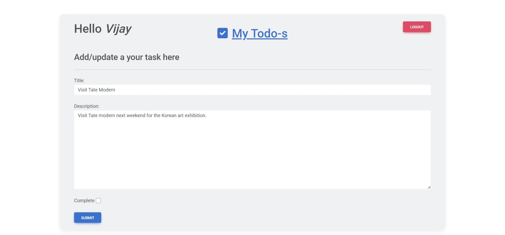
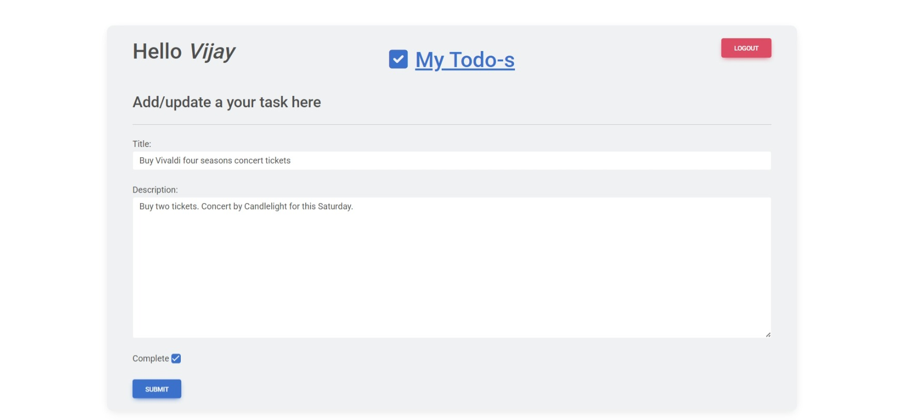
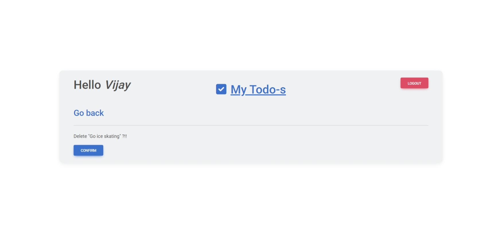
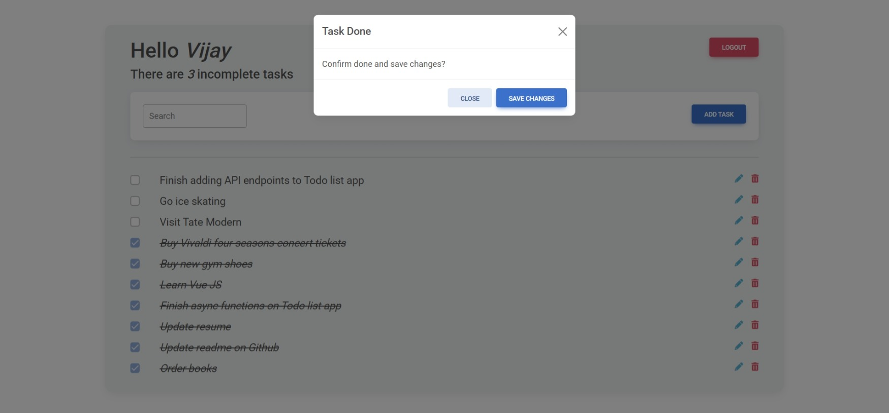
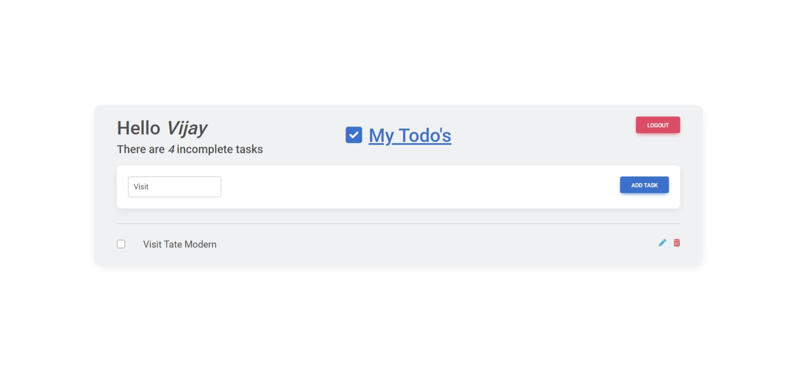

Django To do list app using class based views

## Screenshots

### Registration  Page

### Login Page

### Home page

### Add task

### Update task

### Delete task

### Modal update through async call

### Search task

